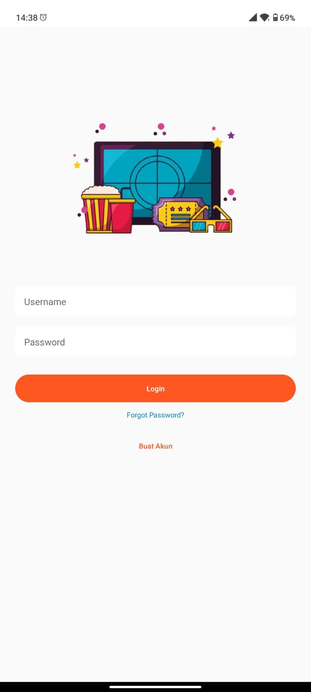
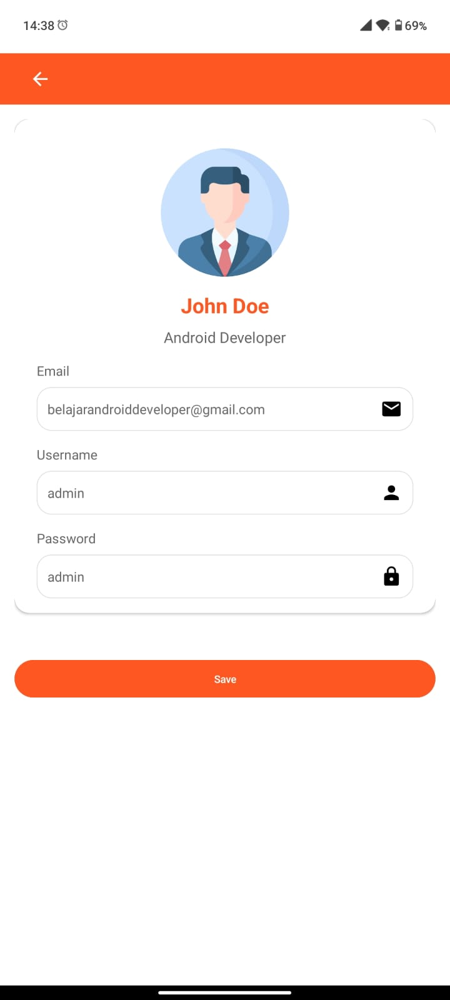
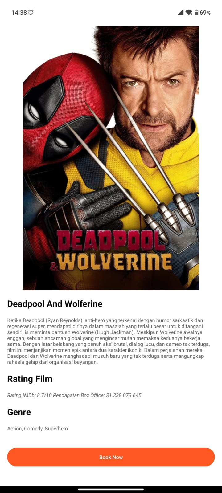

# CinemaHub

CinemaHub is a movie booking and rating application that allows users to explore movies, check their ratings, and book tickets directly through the app. The app leverages a **RecyclerView** to display a list of movies with their respective ratings. By clicking on a movie, users can view detailed information and rate the film.

## Screenshots

### Login Page


### Home Screen


### Detail Profile


### Detail Movie


## Features

- **Movie List**: Displays a list of movies using a `RecyclerView`.
- **Movie Rating**: Shows the ratings of each movie from a predefined source.
- **Movie Detail View**: On clicking a movie, users can view detailed information about it.
- **Intent Handling**: When a user selects a movie, an intent opens a new activity displaying the movie's detailed information and allows users to rate the movie.
- **Admin Login**: Admin can log in using the username `admin` and password `admin`.

## Prerequisites

- Android Studio
- Android SDK
- Java or Kotlin programming language

## Installation

1. Clone the repository to your local machine:
   ```bash
   git clone https://github.com/your-username/CinemaHub.git
   ```

2. Open the project in Android Studio.

3. Sync the project with Gradle.

4. Run the app on an emulator or device.

## Usage

- **Admin Login**: Admin can log in using the following credentials:
  - **Username**: `admin`
  - **Password**: `password`
  
- **RecyclerView**: The `RecyclerView` in the app displays a list of movies. Each movie item includes the title, description, and rating.
  
- **Intent for Movie Details**: Clicking a movie triggers an intent that opens a new activity to display more details about the movie.

- **Rating**: Each movie has a rating displayed in the list. Ratings are pulled from an external source or a local database.

## Example Code Snippet

```java
// Setting up RecyclerView with movie data
RecyclerView recyclerView = findViewById(R.id.recyclerView);
MovieAdapter adapter = new MovieAdapter(movieList);
recyclerView.setLayoutManager(new LinearLayoutManager(this));
recyclerView.setAdapter(adapter);

// On movie item click
adapter.setOnItemClickListener(new MovieAdapter.OnItemClickListener() {
    @Override
    public void onItemClick(int position) {
        Movie selectedMovie = movieList.get(position);
        Intent intent = new Intent(MainActivity.this, MovieDetailActivity.class);
        intent.putExtra("MOVIE_ID", selectedMovie.getId());
        startActivity(intent);
    }
});
```

## License

This project is licensed under the MIT License.

---

This version includes the login details for admin and provides the necessary information to use the app's features. Feel free to customize it further!
